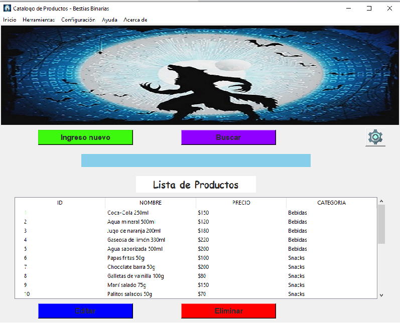

##  Proyecto-Integrador-3er-Semestre-Bestias-Binarias
# Catalogo de Productos - Bestias Binarias

Este proyecto es un catálogo de productos desarrollado por Bestias Binarias utilizando la biblioteca Tkinter de Python.

## Requisitos

- Python 3.x
- Tkinter
- PIL
- SQLite3

## Instalación

### Clona este repositorio en tu máquina local:
`git clone <URL_DEL_REPOSITORIO>`

### Navega hasta el directorio del proyecto:
`cd <directorio_del_proyecto>`

### Ejecuta el siguiente comando para instalar las dependencias:
`pip install -r requirements.txt`

## Uso
### Ejecuta el siguiente comando para iniciar la aplicación:
`python catalogo_productos.py`
Aparecerá una ventana con un catálogo de productos. Puedes utilizar el menú de la aplicación para realizar varias acciones, como crear registros en la base de datos, editar registros, eliminar registros, buscar productos, cambiar el color de fondo, etc.

## Estructura del proyecto
El proyecto se compone de los siguientes archivos:

`catalogo_productos.py`: El archivo principal que contiene el punto de entrada del programa. Aquí se crea la ventana principal de la aplicación y se llama a la función main().

`gui_app.py`: Este archivo contiene las clases y funciones relacionadas con la interfaz de usuario de la aplicación.

`conexion_db.py`: Este archivo contiene la clase ConexionDB, que se encarga de manejar la conexión a la base de datos.

`producto_dao.py`:  Este archivo maneja el acceso a los datos para realizar las operaciones CRUD.

img/: Este directorio contiene las imágenes utilizadas en la aplicación.

### Autores
- Daiana Escudero
- Daniel Guerrero
- Mariana Cervantes
- Gabriel Romero
- Fernando Silva
- Nahuel Tapia
- Florencia Ortega
- Albano Calamara
- Nicolas Muros
- David Mato

--------------------------------------------------------------------------

 
